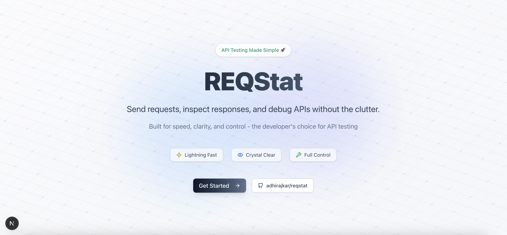
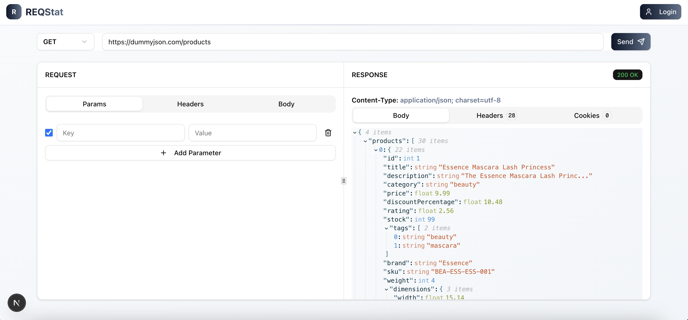

# REQStat

A modern, browser-based API testing tool built with Next.js and React. REQStat provides a clean, intuitive interface for testing HTTP APIs directly in your browser, similar to Postman or Insomnia but without the need for desktop installation.

## Screenshots

### Home Page


### Dashboard - API Testing Interface


## Features

### 🚀 Core Functionality
- **Multiple HTTP Methods**: Support for GET, POST, PUT, DELETE, and PATCH requests
- **Request Configuration**: 
  - Dynamic query parameters with enable/disable toggles
  - Custom headers management
  - Request body support (JSON, Form data, or no body)
- **Smart URL Handling**: Automatic HTTPS prefixing for convenience
- **CORS Bypass**: Built-in proxy to handle CORS restrictions

### 📊 Response Handling
- **Multiple View Formats**:
  - JSON with syntax highlighting
  - HTML preview in sandboxed iframe
  - Plain text display
- **Response Details**:
  - HTTP status codes with color-coded badges
  - Response headers in tabular format
  - Cookie parsing and display
  - Response time tracking

### 🎨 User Interface
- Split-panel layout with resizable sections
- Dark/light theme support
- Modern, animated UI with gradient effects
- Responsive design for all screen sizes
- Real-time URL encoding display

## Getting Started

### Prerequisites
- Node.js 18.17 or later
- npm or yarn package manager

### Installation

1. Clone the repository:
```bash
git clone https://github.com/adhirajkar/reqstat.git
cd req-stat
```

2. Install dependencies:
```bash
npm install
# or
yarn install
```

3. Run the development server:
```bash
npm run dev
# or
yarn dev
```

4. Open [http://localhost:3000](http://localhost:3000) in your browser

## Usage

1. Navigate to `/dashboard` to access the API testing interface
2. Enter your API endpoint URL (HTTPS will be added automatically if omitted)
3. Select the HTTP method from the dropdown
4. Configure your request:
   - Add query parameters using the "Params" tab
   - Set custom headers in the "Headers" tab
   - Add request body in the "Body" tab (for POST, PUT, PATCH requests)
5. Click "Send" to execute the request
6. View the response in the right panel with options to see:
   - Response body (formatted based on content type)
   - Response headers
   - Cookies (if any)

## Tech Stack

- **Framework**: [Next.js](https://nextjs.org/) 15.5.0
- **UI Library**: [React](https://reactjs.org/) 19.1.0
- **Language**: [TypeScript](https://www.typescriptlang.org/)
- **Styling**: [Tailwind CSS](https://tailwindcss.com/) v4
- **State Management**: [Zustand](https://github.com/pmndrs/zustand)
- **UI Components**: [Radix UI](https://www.radix-ui.com/)
- **Theme Management**: [next-themes](https://github.com/pacocoursey/next-themes)
- **Icons**: [Lucide React](https://lucide.dev/)

## Project Structure

```
req-stat/
├── app/                  # Next.js app directory
│   ├── api/proxy/       # Server-side proxy endpoint
│   ├── dashboard/       # Main API testing interface
│   ├── layout.tsx       # Root layout with providers
│   └── page.tsx         # Landing page
├── components/          # React components
│   ├── core/           # Application-specific components
│   │   ├── request-panel.tsx
│   │   ├── response-panel.tsx
│   │   └── request-tab.tsx
│   ├── theme/          # Theme management components
│   └── ui/             # Reusable UI components
├── store/              # Zustand stores
│   ├── useReqStore.ts  # Request state management
│   ├── useResStore.ts  # Response state management
│   └── useLoadingStore.ts
├── lib/                # Utility functions
└── public/             # Static assets
```

## Contributing

Contributions are welcome! Please feel free to submit a Pull Request.

1. Fork the repository
2. Create your feature branch (`git checkout -b feature/AmazingFeature`)
3. Commit your changes (`git commit -m 'Add some AmazingFeature'`)
4. Push to the branch (`git push origin feature/AmazingFeature`)
5. Open a Pull Request

## License

This project is open source and available under the [MIT License](LICENSE).

## Author

Created by [adhirajkar](https://github.com/adhirajkar)

## Acknowledgments

- Built with inspiration from tools like Postman and Insomnia
- Thanks to the open source community for the amazing libraries used in this project